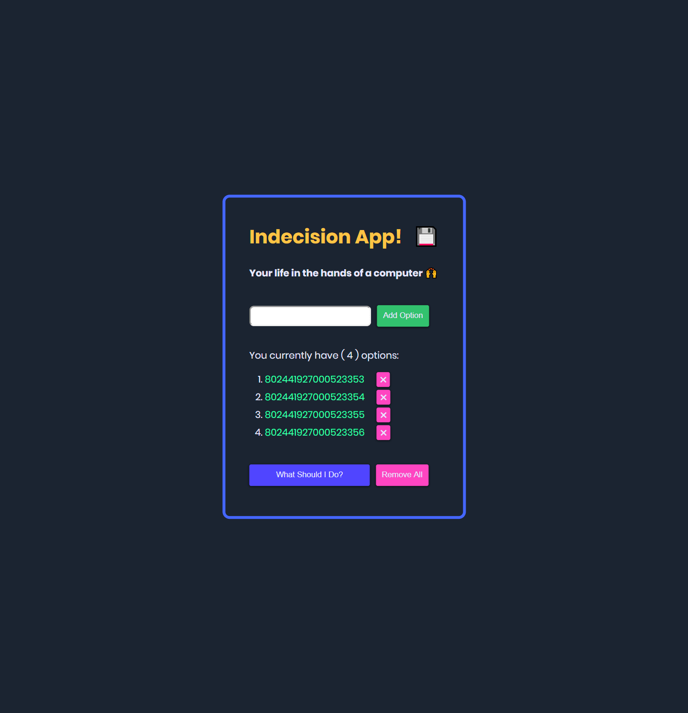

# [Modern JavaScript Bootcamp 2019](#)

Modern JavaScript Bootcamp (2019), powered by [javascript, node, express,](#).

##### Try version `1.0.0-beta` using the following [link](#).  Thanks!


## Built Using

```javascript
import { Javascript, CSS, HTML, Node, Express } from "dependencies";
```

